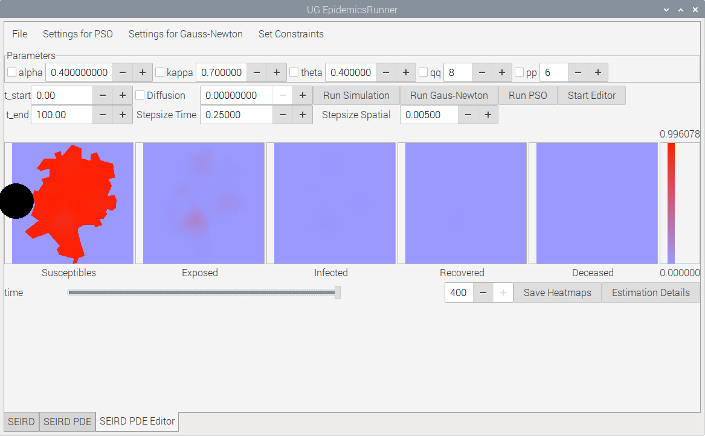
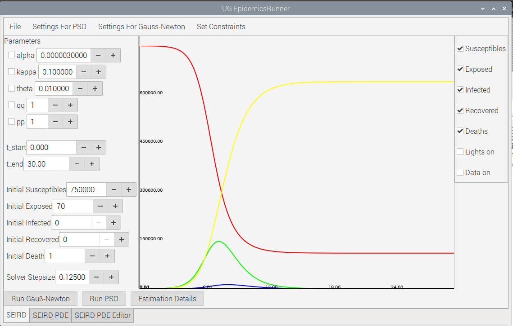

# Epidemics #

**Epidemics** is a [UG4 Plugin](https://github.com/UG4) that provides various algorithms
for epidemics modeling.

# Contents
This document should give a broad overview on **Epidemics** combined with some usage examples.
It also provides some brief notes concerning the installation of the plugin.

* [Installation Notes](#installation)
* [Description](#description)
* [Example](#description)

Sample problems can be found in the Samples Folder.

An optional GUI has been created for the use of estimation or prototyping. This GUI has been shown to work on
Windows, Linux and MacOS.
 
  

  
  
# Installation Notes 
## General
The installation equals the standard process for adding UG4 plugins described on [the ughub GitHub page.](https://github.com/UG4/ughub)
Due to the usage of OS specific functions for process generation, the plugin is not necessarily multiplatform. 
In its current form, the package has been shown to work on Windows 10, Linux Ubuntu and Raspberry Pi OS. 
The GCC, Apple Clang and MSVC compilers were tested.
It is assumed that the package also works for older compiler versions that support C++17. On Linux Ubuntu, 
only GCC was tested. GCC and Clang might require special flags 
set in the build process, which is explained below. The utilized Visual Studio compiler has not exhibited such necessities
but older versions might. 

## Installation notes for GCC
Follow the steps on [the ughub GitHub page.](https://github.com/UG4/ughub) If errors occur,
proceed with this text.
The plugin makes use of C++ std::threads. This might necessitates activating the -pthread flag
to the build process for ug4. Within your UG4 install library, go to

    cd ug4/ugcore/cmake/

and open 

    ug_includes.cmake

Now search for
```
elseif("${CMAKE_CXX_COMPILER_ID}" STREQUAL "GNU")
   add_cxx_flag("-Wall")
   add_cxx_flag("-Wno-multichar")
   add_cxx_flag("-Wno-unused-local-typedefs")
   add_cxx_flag("-Wno-maybe-uninitialized")
```
and add 

    add_cxx_flag("-pthread")

to the GNU include statements. Now rebuild UG4 as described on [the ughub GitHub page.](https://github.com/UG4/ughub) The plugin should
now be installed without any issues.

## Installation notes for Clang
Follow the steps on [the ughub GitHub page.](https://github.com/UG4/ughub). If errors occur,
proceed with this text.
The plugin makes use of C++11 features, like std::threads and constexpr. This might necessitates activating the -std=c++11 flag
to the build process for ug4. Within your UG4 install library, go to

    cd ug4/ugcore/cmake/

and open 

    ug_includes.cmake

Now search for
```
elseif("${CMAKE_CXX_COMPILER_ID}" STREQUAL "Clang")
    add_cxx_flag("-Wall")
    add_cxx_flag("-Wno-multichar")
```
and add 

    set(CMAKE_CXX_FLAGS "${CMAKE_CXX_FLAGS} -std=c++11")

to the Clang include statements. This ensures that the -std=c++11 flag is only added to the C++ compiler and not
the C compiler in the build process. Now rebuild UG4 as described on [the ughub GitHub page.](https://github.com/UG4/ughub). The plugin should
now be installed without any issues.


# Description
The following algorithms are currently implemented:

|Name|Description|
|---|---|
|SIR|Classical Susceptible-Infected-Recovered-Deaths ODE Model|
|SEIRD| Extended SIR model accounting for a new class (Exposed) amongst other additions|
|SEIRD_VARA|Extended SRI model paired with variable (over time) infection rate|
|SEIRD_PDE| A PDE formulation of the SEIRD model, discretized using Finite Differences|
